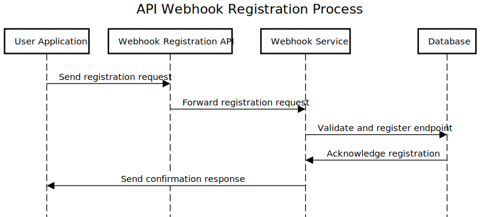
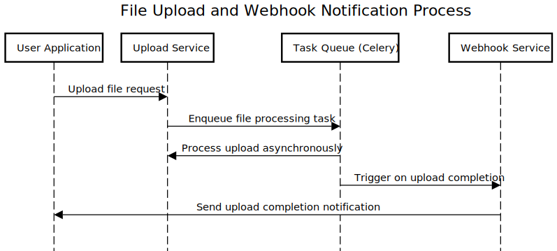
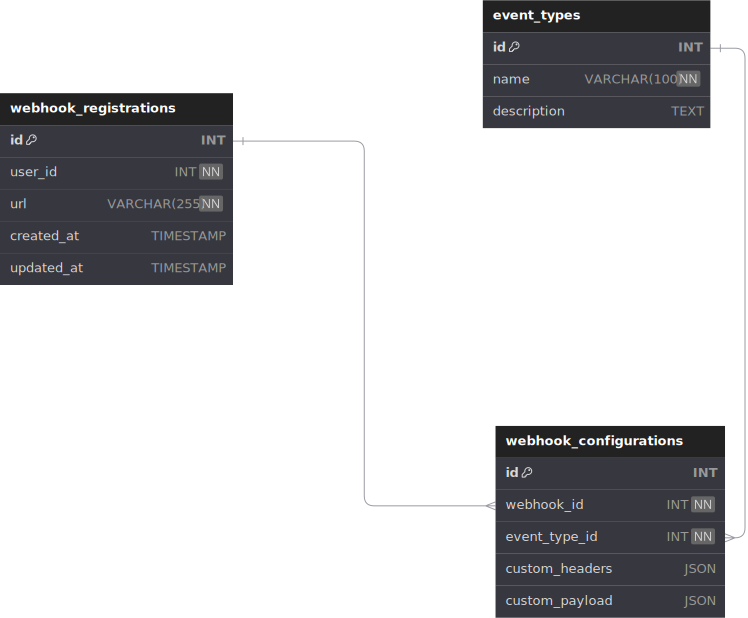
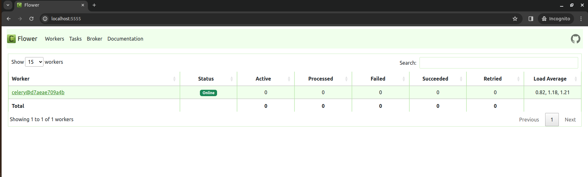
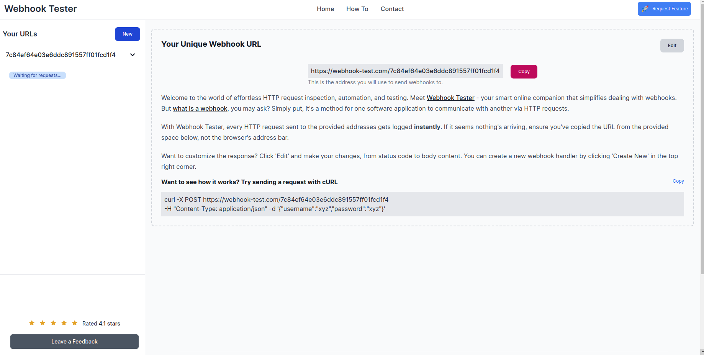

# design-webhook-system

## Sequence API Webhook Registration Process



the sequence of interactions for registering a webhook could be as follows:
- The User Application sends a registration request to the Webhook Registration API.
- The Webhook Registration API forwards this request to the Webhook Service.
- The Webhook Service validates the request and registers the endpoint in the Database.
- The Database acknowledges the registration.
- The Webhook Service sends a confirmation response back to the User Application.

## Sequence File Upload and Webhook Notification Process



The sequence of interactions could be as follows:
- User Application: The external application where the user initiates the file upload.
- Upload Service: A Python-based service that handles file uploads.
- Task Queue (Celery): Manages asynchronous tasks, such as processing the file upload.
- Webhook Service: Notifies the User Application via a webhook when the upload is successfully completed.

## Database



## Tech Stack

- Python: The main programming language for application and task processing.
- PostgreSQL: The relational database for storing application data.
- Redis: Used as a message broker for Celery.
- Celery: A task queue for processing background tasks asynchronously.
- Flower: A tool for monitoring Celery tasks in real-time.
- Docker & Docker Compose: For containerization and orchestration, ensuring consistent environments.


## Project Structure
```
- .gitignore
- Makefile
- README.md
- app
  - Dockerfile
  - api
    - __init__.py
    - event_type.py
    - upload.py
    - webhook.py
  - controllers
    - __init__.py
    - event_type.py
    - webhook_register.py
  - core
    - const.py
    - database.py
    - factory.py
    - response.py
  - gunicorn.conf.py
  - models
    - __init__.py
    - error_log.py
    - event_type.py
    - webhook_configuration.py
    - webhook_registrations.py
  - repositories
    - event_type.py
    - webhook.py
  - requirements.txt
  - schema
    - event_type.py
    - upload_file.py
    - webhook.py
  - server.py
  - tasks

    - task_base_class.py
    - upload_file.py
- client
- docker-compose.yaml
- document
  - database.svg
  - file_upload.svg
  - webhook_register.svg
- logs
  - .keep
  - access.log
  - error.log
- migrate
  - Dockerfile
  - Makefile
  - ddl
    - postgresql
      - 000001_init.down.sql
      - 000001_init.up.sql
  - run.sh
- run_dev.sh
- utils
  - postgresql
    - init
      - init.sh
```
## Migration

```
docker exec develop.webhook.migrate make migrate
```

## Logging

- Gunicorn Logging: Captures access and error logs from the web server.If you want to check it, I implement it and store at logs directory. In this directory , it has two file, `access.log`and `error.log`

- Celery Flower Monitoring: Provides a visual interface for tracking and managing Celery tasks.If you want to check it, please
access to `0.0.0.0:5555`



## API

### List Event Type API

Endpoint: `GET /event_type`

Description: Retrieves a list of all available event types within the system.

Response:

- message (string): A message indicating the outcome of the operation.
- data (array of objects): A list of event types, each object containing:
    - id (string): The unique identifier for the event type.
    - name (string): The name of the event type.
    - description (string): A brief description of the event type.
- error (boolean): Indicates whether there was an error processing the request. false indicates no error occurred.

Example Response:

```
{
  "message": "Successfully !",
  "data": [
    {
      "id": "21f8e1f7-4142-42f9-ac30-74961702b2eb",
      "name": "upload file",
      "description": "Event type for file upload operations"
    }
  ],
  "error": false
}
```

Example: Curl:

```
curl --request GET \
  --url http://0.0.0.0:8081/event_type
```

###  Webhook Registration API

endpoint: `POST /webhook/register`

Description: This endpoint allows users to register a new webhook for a specified event type.

Headers:

Content-Type: application/json
Request Body:

- event_type_id (string): Unique identifier for the event type.
- user_id (integer): Identifier of the user registering the webhook.
- url (string): The webhook URL where callbacks will be sent.
- custom_headers (object): Optional. A set of custom headers to send with the webhook.
- custom_payload (object): Optional. A custom payload to send with the webhook.

Response:

- message (string): Describes the outcome of the request.
- data (object): Contains the following properties:
- id (string): Unique identifier of the registered webhook.
- user_id (integer): Identifier of the user.
- url (string): The registered webhook URL.
- created_at (string): Timestamp of when the webhook was created.
- updated_at (string): Timestamp of the last update to the webhook.
- error (boolean): Indicates if there was an error during the registration process.


Example Response:

```
{
  "message": "Register Webhook Successfully!",
  "data": {
    "id": "441a53ea-93d1-4a87-9b99-ac20616458c3",
    "user_id": 1,
    "url": "https://webhook-test.com/2d082e807e30b6ac57ffebae73569ceb",
    "created_at": "2024-02-27 08:59:08",
    "updated_at": "2024-02-27 08:59:08"
  },
  "error": false
}
```

Example curl:

```
curl --request POST \
  --url http://0.0.0.0:8081/webhook/register \
  --header 'Content-Type: application/json' \
  --data '{
    "event_type_id": "21f8e1f7-4142-42f9-ac30-74961702b2eb",
    "user_id": 1,
    "url": "https://webhook-test.com/2d082e807e30b6ac57ffebae73569ceb",
    "custom_headers": {
        "Content-Type": "application/json",
        "Authorization": "Bearer yourtokenhere"
    },
    "custom_payload": {
        "key1": "value1",
        "key2": "value2"
    }
}'
```

### Upload File API 

Endpoint: `/upload_file/webhook_id/{webhook_id}`

Method: POST


URL Parameters:

webhook_id: The unique identifier of the webhook to which the file is to be uploaded. This is a UUID format string in the path of the URL


Body Parameters:

file: The file to be uploaded. This should be included in the form data of the request. The file parameter should be the actual file you wish to upload, referenced by its file path on the client's system.


Successful Response:

Code: 200 Ok
Content:

- message: A string message indicating the operation was successful, e.g., "ok".
- data: An object containing any data returned by the server in response to the file upload. In this case, it appears to be an empty object.
- error: A boolean value indicating whether an error occurred during the request. A value of false indicates that no error occurred.


Example Curl:

```
curl --request POST \
  --url http://0.0.0.0:8081/upload_file/webhook_id/441a53ea-93d1-4a87-9b99-ac20616458c3 \
  --header 'Content-Type: multipart/form-data; boundary=---011000010111000001101001' \
  --form file=@/path/to/your/file.jpg

```

## How To Start Project

Because I use Docker to develop so you just run this command

```
docker-compose up -d
```

Next step, You should run migrate database, let run this command:


```
docker exec develop.webhook.migrate make migrate
```

API : `http://0.0.0.0:8081`

Postgresql: `http://0.0.0.0:54321`

Redis: `http://0.0.0.0:6379`

Flower: `http://0.0.0.0:5555`

## How To Test


 Here's a step-by-step guide to help you test the full workflow from retrieving the list of event types, registering a webhook for a specific event type, and finally, uploading a file using the registered webhook.

 ## Step 1: Get List of Event Types

- Objective: Retrieve a list of available event types to find an event_type_id for registration.
- Action: Send a GET request to /event_type.
- Expected Response: A JSON response containing a list of event types. From this list, note the id of the event type you wish to use for registering a webhook.

Example curl:

```
curl --request GET \
  --url http://0.0.0.0:8081/event_type
```


## Step 2: Register a Webhook

- Objective: Use the event_type_id obtained from Step 1 to register a new webhook.
- Pre-requisite: Have the event_type_id ready from Step 1.
- Action: Send a POST request to /webhook/register with the required JSON payload, including event_type_id, user_id, url, and optionally, custom_headers and custom_payload.
- Expected Response: A JSON response indicating successful registration, including a webhook id. This id is needed for the file upload step.

Example curl:

```
curl --request POST \
  --url http://0.0.0.0:8081/webhook/register \
  --header 'Content-Type: application/json' \
  --data '{
    "event_type_id": "<event_type_id>",
    "user_id": 1,
    "url": "https://webhook-test.com/callback",
    "custom_headers": {
        "Content-Type": "application/json",
        "Authorization": "Bearer yourtokenhere"
    },
    "custom_payload": {
        "key1": "value1",
        "key2": "value2"
    }
}'
```

Replace <event_type_id> with the actual id you obtained in Step 1.

# Step 3: Upload File Using the Registered Webhook

- Objective: Upload a file using the webhook id obtained from Step 2.
- Pre-requisite: Have the webhook_id from the successful webhook registration.
- Action: Send a POST request to /upload_file/webhook_id/{webhook_id} with the file included in the form data.
- Expected Response: A JSON response indicating that the file upload was successful.

Example Curl:

```
curl --request POST \
  --url http://0.0.0.0:8081/upload_file/webhook_id/<webhook_id> \
  --header 'Content-Type: multipart/form-data; boundary=---011000010111000001101001' \
  --form file=@/path/to/your/file.jpg
```

Replace <webhook_id> with the actual id you received after registering the webhook in Step 2.

I recommend  to demonstrate webhook url

